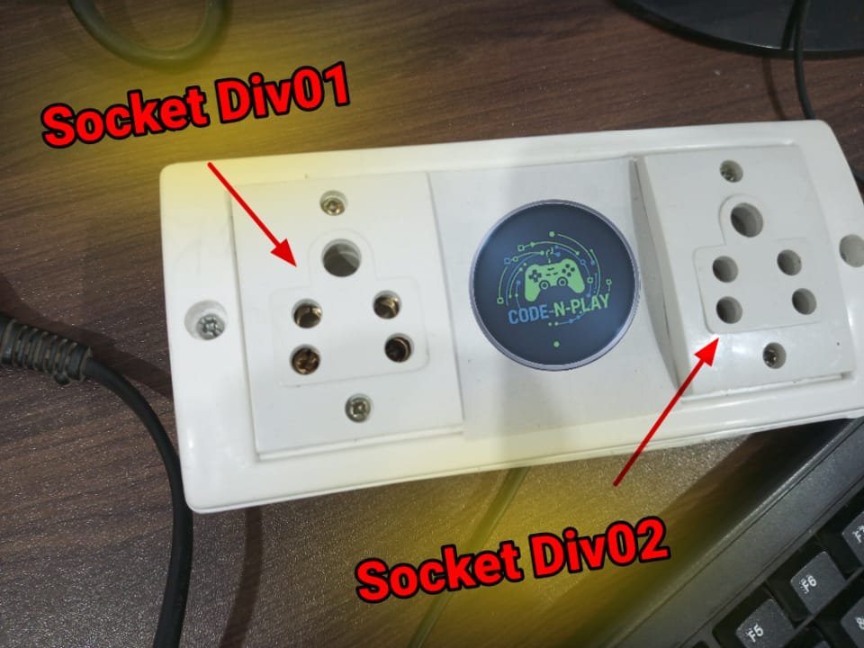

# Smart Socket

## Overview
The **Smart Socket** system enables remote and local control of electrical appliances, improving convenience, safety, and energy efficiency. It is designed to be user-friendly, cost-effective, and scalable, making it suitable for homes, offices, and public institutions.

---

### Images

     

        
        
    

## Advantages of Smart Socket System

### 1. Remote Control
- Appliances can be turned **ON/OFF** from anywhere using a smartphone.
- Reduces the need for physical movement and manual operation.

### 2. Elder-Friendly Operation
- Simple button-based control through a mobile application.
- Especially helpful for senior citizens with mobility or joint-related issues.

### 3. Support for Differently-Abled People
- Enables independent control of electrical devices without assistance.
- Beneficial for users with physical disabilities or limited hand movement.

### 4. Fallback Local Control (Soft AP Mode)
- Operates even when internet connectivity is unavailable.
- Ensures uninterrupted operation during network failures or emergencies.

### 5. Energy Efficiency
- Prevents unnecessary power consumption by remotely switching off appliances.
- Helps reduce electricity bills and promotes energy conservation.

### 6. Safety Improvement
- Reduces the risk of electric shocks and accidents.
- Appliances can be switched off remotely if left on unintentionally.

### 7. Low Cost and Scalable
- Built using affordable components such as the **ESP32**.
- Additional smart sockets can be easily added to expand the system.

---

## Real-World Applications

### Home Automation
- Control lights, fans, heaters, and chargers.
- Ideal for bedrooms, kitchens, and living rooms.

### Elderly Care
- Seniors can control appliances from a bed or wheelchair.
- Family members can assist remotely when needed.

### Differently-Abled Assistance
- Helps users with physical disabilities live more independently.
- Reduces reliance on caregivers.

### Hospitals & Healthcare Centers
- Remote control of medical equipment and room appliances.
- Useful in patient rooms and nursing homes.

### Offices & Workspaces
- Efficient management of electrical devices.
- Prevents energy wastage after office hours.

### Educational Institutions
- Centralized control of laboratory equipment and classroom devices.
- Enhances safety and operational efficiency.

### Hotels & Hostels
- Smart control of room appliances.
- Improves guest comfort while reducing energy consumption.